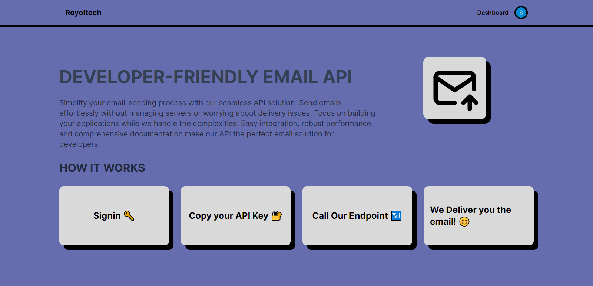
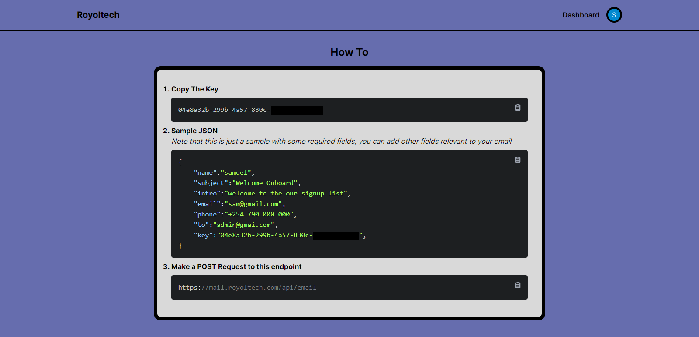

# Mail Service
### Overview
Mail Service is a convenient API-based solution for developers to send emails with ease. With a simple API call, you can send emails without worrying about the underlying complexities of email infrastructure.

### How it Works
Make an API call to our Mail Service endpoint with the required email details (e.g., recipient, subject, body, etc.).
Our service takes care of sending the email on your behalf.
### Preview

### Getting Started
To start using Mail Service, follow these steps:

- Sign up for an API key on our website.
- Integrate our API into your application using your preferred programming language.
- Start sending emails with a simple API call!

### API Documentation
Coming soon! Our API documentation will be available shortly, providing detailed information on API endpoints, request/response formats, and more.

### Support
If you have any questions or need assistance, please don't hesitate to reach out to us at info@royoltech.com.

### License
Mail Service is licensed under MIT License.

### Contributing
We welcome contributions to Mail Service! If you'd like to contribute, please fork our repository and submit a pull request.

